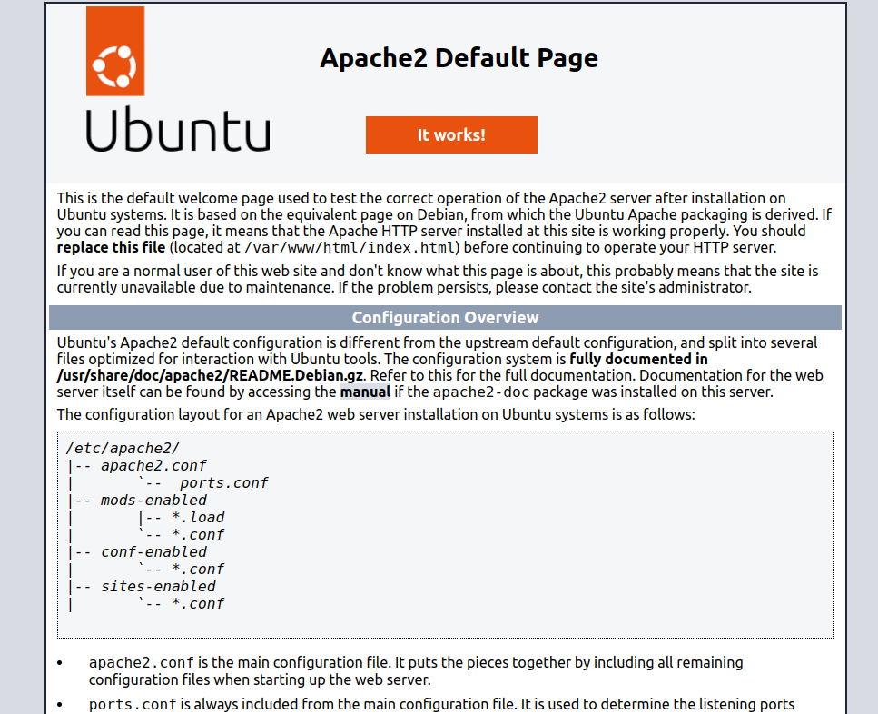

# Exercise: Challenge A

We want a ROCK that runs an Apache (`apache2`) web server when the container is
started.

## Requirements

- [ ] The ROCK must be named "challenge-a"
- [ ] The ROCK must be based on Ubuntu 22.04
- [ ] When the container starts, it must run `apache2ctl [ -D FOREGROUND ]`

## Expected Output

The container must start the Apache server and the webpage must be reachable
from the host:

```bash
docker run -p 8080:80 --rm challenge-a
```

```log
2023-10-19T12:36:39.845Z [pebble] Started daemon.
2023-10-19T12:36:39.849Z [pebble] POST /v1/services 3.830113ms 202
2023-10-19T12:36:39.849Z [pebble] Started default services with change 1.
2023-10-19T12:36:39.852Z [pebble] Service "web" starting: apache2ctl [ -D FOREGROUND ]
2023-10-19T12:36:39.893Z [web] AH00558: apache2: Could not reliably determine the server's fully qualified domain name, using 172.17.0.2. Set the 'ServerName' directive globally to suppress this message

```

*localhost:8080*


## Useful Resources

- `services` reference: <https://canonical-rockcraft.readthedocs-hosted.com/en/latest/reference/rockcraft.yaml/#services>
- `overlay-packages` property: <https://canonical-rockcraft.readthedocs-hosted.com/en/latest/explanation/overlay-step/>
- copying the OCI archive to Docker and running it: <https://canonical-rockcraft.readthedocs-hosted.com/en/latest/tutorials/hello-world/#run-the-rock-in-docker>
